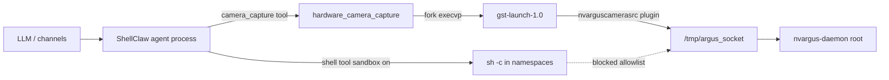

# ShellClaw Security

This document is the v1.0 security assurance record (Wave 7, slice 04). It consolidates self-audit findings from tasks 7.1–7.7, mitigations implemented in tree, and honest scope limits. Read [Limitations](#limitations) before treating this as third-party assurance.

**Related code:** [`src/sandbox/`](../src/sandbox/) · [`src/gateway/`](../src/gateway/) · [`src/hardware/`](../src/hardware/) · [`src/asap/manifest_keys.c`](../src/asap/manifest_keys.c)

---

## Threat model (summary)

ShellClaw runs as a user-level agent on edge boards (Jetson Orin Nano Super, Raspberry Pi). Untrusted input arrives via chat channels (Telegram, Discord, Web UI) and may invoke:

- **Shell tool** — subprocess with optional Linux namespaces + allowlist.
- **File tool** — workspace-scoped paths when configured.
- **Hardware tools** — GPIO, I2C, camera (gateway `/api/hardware/*` is Bearer-authenticated in v1.0).
- **ASAP / gateway** — Bearer-authenticated `/api/*` HTTP and WebSocket. `POST /asap` is protocol-public (rate-limited, not Bearer); authenticity is `[asap].trusted_senders`.

The primary goals are: prevent sandboxed shell commands from escaping to host destruction, block direct GPU/camera daemon access from the shell sandbox, and keep signing keys and cloud credentials off disk with unsafe permissions.

---

## Audit summary (v1.0)

| ID | Finding | Severity | Mitigation | Residual risk | Tests / verification |
|----|---------|----------|------------|---------------|----------------------|
| 7.1 | Jetson GPU `/dev` nodes visible in shell mount namespace (no `pivot_root`, no bind-mount isolation) | Medium | Substring blocklist for `/dev/nvhost`, `/dev/nvgpu`, `/dev/nvmap` in `allowlist.c`; `sandbox_exec()` uses `unshare` only | Indirect paths or globs may bypass literal blocklist | `tests/test_allowlist.c` (`test_block_jetson_gpu_devices`) |
| 7.1 | `pivot_root` hardening not implemented | Low (documented) | Allowlist + namespace network/PID isolation | Full mount-slave `/dev` tmpfs deferred post-v1.0 | Source audit of `sandbox.c` |
| 7.2 | Camera capture could invoke shell with user-controlled pipeline strings | High (if present) | **Not present:** `hardware_camera_capture()` uses `execvp` + fixed `argv[]`; strict input validation | N/A when validation holds | `tests/test_hardware_camera.c` (injection + `test_no_shell_invocation`) |
| 7.3 | Sandboxed shell could reach Argus IPC socket | Medium | Blocklist `/tmp/argus_socket` and `argus_socket`; camera spawn runs outside shell sandbox by design | Compromised agent process can still spawn GStreamer | `tests/test_allowlist.c` (`test_block_argus_socket`) |
| 7.4 | New `/api/hardware/*` routes expose board/GPIO/I2C/GPU state | Medium | Central Bearer gate in `http_lws.c`; read-only GET handlers; camera POST deferred stub (no rate limit until v1.2 HTTP capture) | Stolen bearer token grants read access until revoked | `tests/test_gateway_http.c`, `tests/test_routes_hardware` |
| 7.5 | Loose permissions on Ed25519 private key | High | `0600` on create; reject load/rotate if `(st_mode & 0077)`; fail on first signed manifest GET | `0400`-only owner key passes group/other check | `tests/test_manifest_keys`, `tests/test_bootstrap_keys` |
| 7.6 | Memory safety / undefined behavior regressions | High | `make static` (cppcheck) + `make test-sanitize` (ASan/UBSan) in CI | Sanitizer builds ≠ release binaries | CI `.github/workflows/ci.yml`, `scripts/ci-local.sh` |

**Release gate:** zero **Critical** findings open; Medium items above have documented mitigations and regression tests.

---

## Sandbox surfaces

| Surface | Mechanism | Notes |
|---------|-----------|-------|
| Shell (sandbox on) | `fork()` + `unshare(CLONE_NEWNS \| CLONE_NEWNET \| CLONE_NEWPID)` + `prctl(PR_SET_NO_NEW_PRIVS)` | See [Linux sandbox (Jetson)](#linux-sandbox-jetson) |
| Shell (sandbox off) | Plain `fork()` + substring fallback blocklist | **Not** a security boundary; stderr warning |
| Allowlist | Substring blocklist + optional workspace `realpath` containment | Defense in depth before `sandbox_exec` |
| cgroups v2 | `memory.max`, `cpu.max` on child PID | Best-effort; non-fatal if cgroup write fails |
| Hardware GPIO/I2C | libgpiod / `i2c-dev` in agent process | Not exposed inside shell namespace |

Implementation: [`src/sandbox/sandbox.c`](../src/sandbox/sandbox.c), [`src/sandbox/allowlist.c`](../src/sandbox/allowlist.c).

---

## Linux sandbox (Jetson)

**Audit task 7.1 (2026-05-25).** Reviewed `src/sandbox/sandbox.c` and `src/sandbox/allowlist.c` against JetPack 6.2.x (kernel 5.15) on Jetson Orin Nano Super.

### GPU device nodes — not bind-mounted

`sandbox_exec()` does **not** call `mount()`, `bind()`, or `pivot_root()`. The child namespace is created only with:

```c
unshare(CLONE_NEWNS | CLONE_NEWNET | CLONE_NEWPID);
```

Therefore ShellClaw never bind-mounts Tegra GPU devices into the sandbox. In particular, these paths are **not** explicitly mounted into the shell namespace:

- `/dev/nvhost-*`
- `/dev/nvgpu`
- `/dev/nvmap`

### `pivot_root` — not used (v1.0)

The task checklist references `unshare(CLONE_NEWNS) + pivot_root` as a hardened pattern. **v1.0 does not implement `pivot_root`.** After `unshare(CLONE_NEWNS)`, the child inherits a **copy** of the host mount tree (default propagation). Jetson `/dev` nodes remain visible inside the new mount namespace unless blocked elsewhere.

**Mitigation in v1.0:** the shell allowlist rejects commands whose text references `/dev/nvhost`, `/dev/nvgpu`, or `/dev/nvmap` (substring blocklist). Regression tests live in `tests/test_allowlist.c` (`test_block_jetson_gpu_devices`).

**Residual risk:** a crafted command that opens GPU nodes without those literal substrings (e.g. shell globs or indirect paths) may still reach devices until a future release adds mount-slave propagation, a minimal `/dev` tmpfs, or seccomp. Track as post-v1.0 hardening.

### Board-agnostic blocklist entries (Jetson literals)

[`src/sandbox/allowlist.c`](../src/sandbox/allowlist.c) lists Jetson GPU paths (`/dev/nvhost`, `/dev/nvgpu`, `/dev/nvmap`) and Argus socket strings for **all** boards. These are **substring deny rules** on the shell command line, not board-specific mounts or runtime `board_id` checks. On Raspberry Pi or stub builds the entries are inert (no matching devices) but keep one shared allowlist binary. They do not hide `/dev` nodes from the inherited mount namespace — see [GPU device nodes](#gpu-device-nodes--not-bind-mounted) above.

### Network and PID isolation

- `CLONE_NEWNET` — sandboxed shell has no routable network (no interface setup in child).
- `CLONE_NEWPID` — PID namespace; child is PID 1 in its namespace for the `sh -c` session.

### JetPack 6 / kernel 5.15 note

Namespace behavior above was verified by **source audit**. On-device validation on JetPack 6.2.x is a [known pending](JETSON_SIGNOFF.md) item (not a CI or merge-to-`main` gate).

---

## Camera capture spawn (task 7.2)

`hardware_camera_capture()` in [`src/hardware/hardware_camera.c`](../src/hardware/hardware_camera.c) never invokes `/bin/sh -c`. The backend builds a fixed `argv[]` and runs `fork()` + `execvp(argv[0], argv)` (or a test hook).

| Input | Validation | Shell / pipeline injection |
|-------|------------|----------------------------|
| `sensor_id` | `int`, range 0–3 → `snprintf(..., "sensor-id=%d", ...)` | Metacharacters cannot appear in argv |
| `resolution` | Strict `WxH` via `sscanf` + trailing-byte check | Suffixes like `640x480;rm` rejected |
| `camera_type` | Whitelist: `auto`, `csi`, `usb` only | Values like `csi\|sh` rejected before spawn |
| `output_path` | `path_chars_safe()` + reject `..` | Shell metacharacters and traversal blocked |
| `video_index` | 0–99 → `/dev/video%d` in argv | Numeric only |

GStreamer pipeline elements (`nvarguscamerasrc`, caps strings, `location=`) are separate argv entries, not a single interpolated shell string.

Regression tests: `tests/test_hardware_camera.c` (`test_*_injection_rejected`, `test_no_shell_invocation`).

---

## NVIDIA Argus / `nvargus-daemon` boundary (task 7.3)

On Jetson CSI cameras, frame capture uses GStreamer `nvarguscamerasrc`, which is a client of **NVIDIA Argus** (`nvargus-daemon`).

### Daemon and socket

| Component | Role |
|-----------|------|
| `nvargus-daemon` | System service, typically **root**; owns the Argus IPC endpoint |
| `/tmp/argus_socket` | Unix domain socket used by Argus clients (JetPack 6.x default path) |
| `gst-launch-1.0` + `nvarguscamerasrc` | Child process spawned by ShellClaw **outside** the shell sandbox |

ShellClaw does **not** bind-mount `/tmp/argus_socket` into the sandboxed shell namespace (`sandbox_exec` uses only `unshare`, per § [Linux sandbox (Jetson)](#linux-sandbox-jetson)).

### Who may talk to Argus



- **Allowed (by design):** the main agent process invokes `hardware_camera_capture()` → `execvp("gst-launch-1.0", …)` with `nvarguscamerasrc` in argv. The GStreamer child connects to Argus as any normal camera client would.
- **Blocked:** the **shell** tool path runs inside `sandbox_exec()` + allowlist. Commands that reference `/tmp/argus_socket` or `argus_socket` are rejected (`src/sandbox/allowlist.c`). Regression: `tests/test_allowlist.c` (`test_block_argus_socket`).

### v1.0 exposure

- **Gateway:** `POST /api/hardware/camera/snapshot` returns a v1.2 placeholder (no HTTP-driven capture in v1.0).
- **LLM tool:** `camera_capture` remains registered when the camera backend is active; it uses the same Argus path above and is subject to channel allowlists / operator trust, not the shell sandbox.

**Residual risk:** a compromised **agent process** (not merely a sandboxed shell command) could still spawn `gst-launch` or other Argus clients. Mitigation is process-level trust and minimizing agent attack surface; socket blocking applies to the **shell sandbox** boundary only.

---

## Gateway `/api/hardware/*` (task 7.4)

**Audit (2026-05-25):** [`src/gateway/http_lws.c`](../src/gateway/http_lws.c) `requires_auth()` treats every `/api/` path as Bearer-protected (except `/health`, `/pair`, `/.well-known/`, `/`). Unauthenticated requests receive **401** before `dispatch_route()` runs.

### Routes (v1.0)

| Method | Path | Auth | Mutating | Notes |
|--------|------|------|----------|-------|
| GET | `/api/hardware/board` | Bearer | No | Board id + backends |
| GET | `/api/hardware/gpio` | Bearer | No | 40-pin snapshot |
| GET | `/api/hardware/i2c-scan` | Bearer | No | Bus scan (read-only) |
| GET | `/api/hardware/gpu` | Bearer | No | Jetson tegrastats JSON |
| GET | `/api/hardware/sensors` | Bearer | No | v1.2 deferred stub |
| POST | `/api/hardware/camera/snapshot` | Bearer | Yes | v1.2 deferred stub; **no per-token rate limit** until Phase 7 HTTP capture |

Handlers: [`src/gateway/routes_hardware.c`](../src/gateway/routes_hardware.c). Non-GET methods on read-only paths return **405**. Example: `POST /api/hardware/board` → 405 (tested in `test_routes_hardware`).

### Camera snapshot (v1.0)

`POST /api/hardware/camera/snapshot` returns the v1.2 deferred JSON stub when authenticated. Per-token throttling was removed from [`src/gateway/rate_limit.c`](../src/gateway/rate_limit.c) until the real HTTP image path ships in Phase 7; Bearer auth still applies via `requires_auth()`.

### Re-verification vs slice 02

Slice 02 introduced these routes; this audit confirms Bearer gating remains centralized in `http_lws.c`. Rate limiting for camera POST is deferred with the capture implementation.

## Inbound ASAP `POST /asap`

`POST /asap` is excluded from Bearer pairing so ASAP peers can call without a ShellClaw token. Authenticity is `[asap].trusted_senders`. An empty list (local/dev default) allows every claimed URN.

After provider/tool wiring in `handle_asap` (#53), a sender that passes that check can:

- `task.request` — `agent_run()` with the same tool table as chat (`shell`, `file`, hardware, `asap_invoke`, …)
- `mcp.tool_call` — `execute()` with attacker-chosen name and arguments (no LLM)

Default gateway bind is `127.0.0.1`, which contains this for stock installs. Production MUST set `trusted_senders` before exposing the gateway (`allow_bind_all`, tunnel, marketplace URL). Restricting the inbound MCP tool table (or failing closed when the allowlist is empty and the host is not loopback) is a follow-up.

---

## Ed25519 signing keys (task 7.5)

**Audit (2026-05-26):** Re-verified slice 03 key handling in [`src/asap/manifest_keys.c`](../src/asap/manifest_keys.c). Keys load lazily on the first `GET /.well-known/asap/manifest.json` via `manifest_keys_ensure_loaded()` in [`src/gateway/routes.c`](../src/gateway/routes.c); CLI/agent without gateway does not require `~/.shellclaw/keys/` at startup.

### Paths and layout

| File | Path | Mode on create |
|------|------|----------------|
| Private key | `$SHELLCLAW_HOME/keys/ed25519.priv` (default `~/.shellclaw/keys/ed25519.priv`) | `0600` |
| Public key | `…/keys/ed25519.pub` | `0600` |
| Keys directory | `…/keys/` | `0700` (`mkdir` on first use) |

`SHELLCLAW_HOME` overrides the base directory (same as config and auth tokens).

### Permission enforcement

`manifest_priv_permissions_ok()` rejects `ed25519.priv` when **any** group or other permission bit is set (`st_mode & 0077`). This covers `0644`, `0660`, and world-readable modes. New and rotated keys are written with `open(…, 0600)` plus `fchmod(…, 0600)` after write.

| Operation | Loose `ed25519.priv` behavior |
|-----------|-------------------------------|
| `manifest_keys_load()` | Fails with `ed25519.priv permissions too open (expected 0600)` |
| `manifest_keys_rotate` | Same error (explicit message) |
| Agent startup (`init_subsystems`) | Does **not** load signing keys (gateway/CLI without manifest GET may start without keys) |
| `/.well-known/asap/manifest.json` | Returns **500** if signing keys cannot be loaded (permissions or I/O) |

### Signed manifest gate (lazy load)

The keypair is loaded (or created) on the first signed manifest request, not at `init_subsystems()`. A world-readable `ed25519.priv` blocks manifest discovery but does not block one-shot `-m` runs that never hit the gateway manifest route.

### Regression tests

- `tests/test_manifest_keys`: `test_manifest_keys_first_run_creates` (0600 on create), `test_manifest_keys_rejects_loose_priv_perms`, `test_manifest_keys_rotate_rejects_loose_priv`
- `tests/test_bootstrap_keys`: CLI starts without keys; `manifest_keys_ensure_loaded` rejects loose priv
- `tests/test_daemon_smoke.sh`: post-`--rotate-keys` stat expects mode `600` on both key files

**Residual note:** Only `ed25519.priv` permissions are checked on load; `ed25519.pub` is not re-stat'd for mode (public material). Owner-only `0400` on the private key passes the group/other check but is not exactly `0600`; created keys always use `0600`.

---

## Static analysis and sanitizers (task 7.6)

**Audit (2026-05-26):** Re-ran `make static` and `make test-sanitize` on the development branch; both exit 0. CI runs the same steps on `ubuntu-24.04` (`.github/workflows/ci.yml`).

### cppcheck (`make static`)

| Item | Value |
|------|--------|
| Tool | [cppcheck](https://cppcheck.sourceforge.io/) (CI installs via `apt`) |
| Scope | `src/` only (vendored trees excluded from the walk) |
| Enables | `warning`, `style`, `performance`, `portability` |
| Failure mode | `--error-exitcode=1` — any reported issue fails the build |

Curated suppressions in the Makefile cover known false positives (e.g. `knownConditionTrueFalse` in config reload paths, TweetNaCl `variableScope`). This is stricter than a one-off `--enable=all` run, which floods style noise on cJSON and ASAP helpers without improving security signal.

Local: `make static`

### AddressSanitizer + UndefinedBehaviorSanitizer

| Item | Value |
|------|--------|
| Command | `make test-sanitize` |
| Flags | `-fsanitize=address,undefined`, `-fno-omit-frame-pointer`, `-Werror` (via `CI=true`) |
| Suite | Full `make test` with `GATEWAY=1` (includes `test_gateway_http`, hardware, sandbox, manifest) |

Local (matches CI):

```bash
make test-sanitize
```

Full pre-release mirror on Linux: `./scripts/ci-local.sh` (static → test → `LIBGPIOD=0` test → sanitizer → release size → coverage).

**Note:** Sanitizer builds are slower and require a toolchain with ASan/UBSan support (GCC/Clang on Linux or macOS). They are not used for release binaries (`make release`).

---

## Jetson-specific security (consolidated)

This section summarizes Jetson Orin Nano Super / JetPack 6.2.x concerns that do not apply to Raspberry Pi or generic x86 dev machines.

| Surface | Jetson-specific behavior | Primary mitigation | Source |
|---------|-------------------------|-------------------|--------|
| Shell sandbox | Tegra GPU character devices remain in inherited mount namespace | Literal blocklist on `/dev/nvhost*`, `/dev/nvgpu`, `/dev/nvmap` | `src/sandbox/allowlist.c` |
| Shell sandbox | No `pivot_root` / minimal `/dev` in v1.0 | Documented residual risk; allowlist defense in depth | `src/sandbox/sandbox.c` |
| CSI camera | Argus daemon (`root`) + `/tmp/argus_socket` | Shell blocklist; camera only via agent `execvp` path | `src/hardware/hardware_camera.c`, `allowlist.c` |
| Gateway | GPU telemetry via `tegrastats` parsing | Bearer auth on `/api/hardware/gpu`; read-only GET | `src/gateway/routes_hardware.c` |
| GPIO / I2C | `tegra234-gpio` chips via libgpiod | Hardware tools run in agent process, not shell namespace | `src/hardware/` backends |
| Power / thermals | MAXN_SUPER vs 15W modes affect load | Operational guidance in hardware docs (not a sandbox control) | — |

**v1.0 scope on Jetson:** HTTP camera snapshot and sensor decoders are deferred stubs; LLM `camera_capture` and GPIO/I2C tools remain operator-trusted paths outside the shell sandbox. See [NVIDIA Argus](#nvidia-argus--nvargus-daemon-boundary-task-73) and [Gateway hardware API](#gateway-apihardware-task-74).

**Validation outside CI:** gpio-mockup local ritual plus the on-device checklist in [`JETSON_SIGNOFF.md`](JETSON_SIGNOFF.md). Jetson sign-off is **known pending** (no Jetson runner in GitHub Actions; not a merge-to-`main` gate).

---

## Implementation map (cross-reference)

| Area | Directory / file | Security-relevant behavior |
|------|------------------|----------------------------|
| Sandbox isolation | [`src/sandbox/sandbox.c`](../src/sandbox/sandbox.c) | `unshare` namespaces, cgroups v2 limits, no mount/bind |
| Command policy | [`src/sandbox/allowlist.c`](../src/sandbox/allowlist.c) | Blocklist (incl. Jetson GPU + Argus), workspace path containment |
| Gateway auth | [`src/gateway/http_lws.c`](../src/gateway/http_lws.c) | `requires_auth()` Bearer gate for `/api/*` |
| Hardware HTTP API | [`src/gateway/routes_hardware.c`](../src/gateway/routes_hardware.c) | Read-only GET handlers, camera POST deferred stub |
| Rate limits | [`src/gateway/rate_limit.c`](../src/gateway/rate_limit.c) | Per-IP `/asap` RPM (64-slot table); reuses expired windows; **fail-closed** (429) when table is full and no slot expired |
| Camera spawn | [`src/hardware/hardware_camera.c`](../src/hardware/hardware_camera.c) | argv-only `execvp`, validated resolution/type/path |
| Signing keys | [`src/asap/manifest_keys.c`](../src/asap/manifest_keys.c) | `0600` create, loose-perm rejection, load/rotate guards |
| Signed manifest gate | [`src/gateway/routes.c`](../src/gateway/routes.c) | `manifest_keys_ensure_loaded()` before `manifest_build_signed_json()` |

Automated regression coverage: `tests/test_allowlist.c`, `tests/test_hardware_camera.c`, `tests/test_gateway_http.c`, `tests/test_rate_limit.c`, `tests/test_manifest_build`, `tests/test_manifest_keys`.

### Board-agnostic blocklist entries (Jetson literals)

[`src/sandbox/allowlist.c`](../src/sandbox/allowlist.c) lists Jetson GPU device path substrings (`/dev/nvhost`, `/dev/nvgpu`, `/dev/nvmap`) and Argus socket paths for **all** boards. These are deny-by-path rules in the generic shell blocklist, not runtime `board_id_t` guards: on non-Jetson hosts the entries are harmless no-ops; on Jetson they block sandboxed shell access to GPU nodes and the Argus IPC socket. Camera capture via `hardware_camera_capture()` runs outside the shell sandbox by design.

---

## Limitations

Per project decision **Q-SECREVIEW (DR-020)**:

- **Self-audit only for v1.0.** This document, source review notes in tasks 7.1–7.6, and CI static/sanitizer runs constitute the full assurance package for the v1.0 release. There was **no external penetration test, no third-party code review, and no paid security auditor** for this version.
- **Bug bounty:** not offered for v1.0; **considered post-v1.0** (likely v1.2+ alongside external review — see roadmap).
- **Hardware CI gap:** GitHub Actions does not execute on a physical Jetson. Namespace and libgpiod behavior on Tegra are validated via source audit, unit tests, and the [gpio-mockup release ritual](../.cursor/dev-planning/tasks/phase5/04-release-quality.md#120a-gpio-mockup-local-validation-ritual-q-ci-release-ritual). The [on-device sign-off checklist](JETSON_SIGNOFF.md) is **known pending** and is not a merge-to-`main` gate.
- **Sandbox depth:** substring blocklists and namespace isolation are defense in depth, not a formal proof against a determined attacker with shell access when sandbox mode is disabled or when the agent process itself is compromised.

**Do not describe ShellClaw v1.0 as "externally audited" or "pen-tested."**

---

*Last updated: 2026-05-26 — Wave 7.7 published (tasks 7.1–7.7); satisfies doc task 9.4.*
